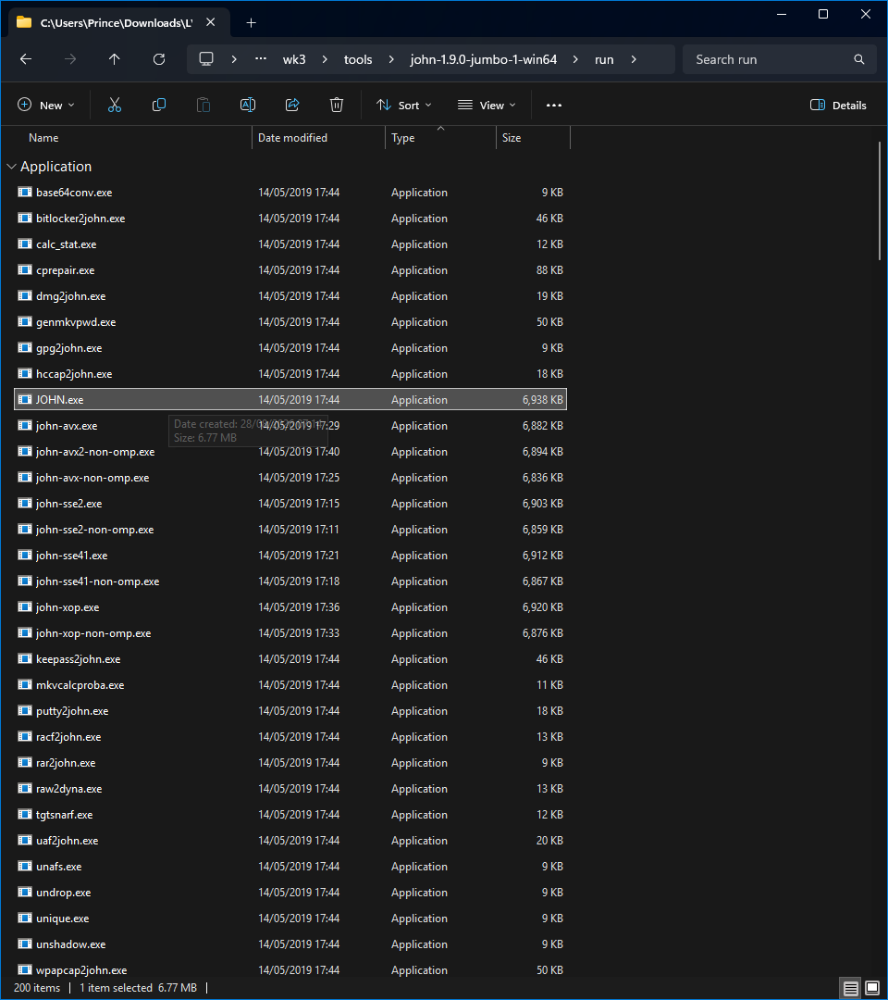
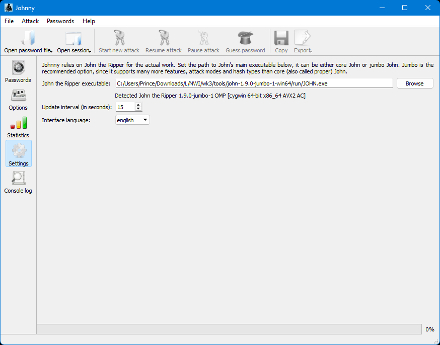
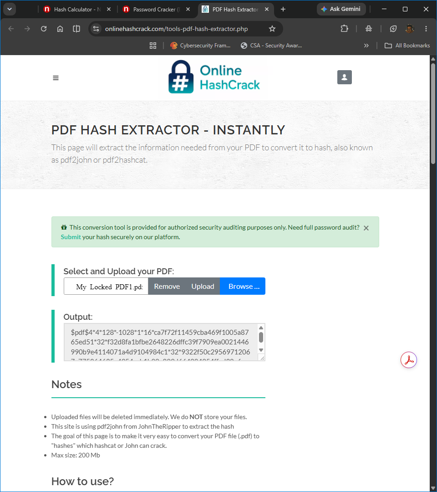
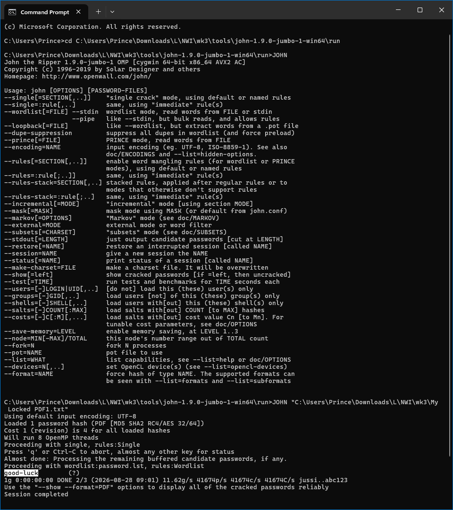
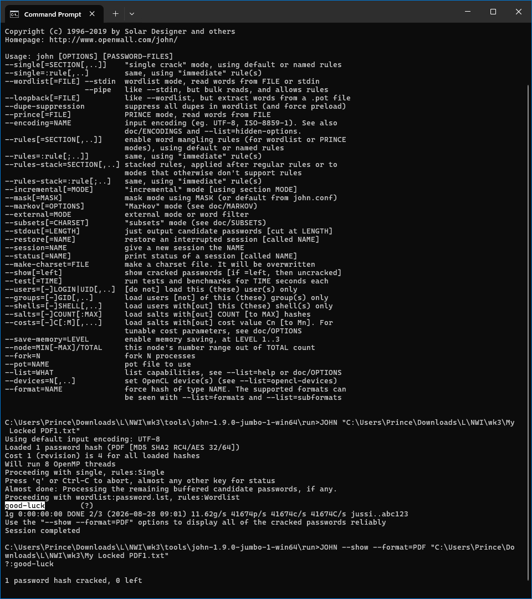
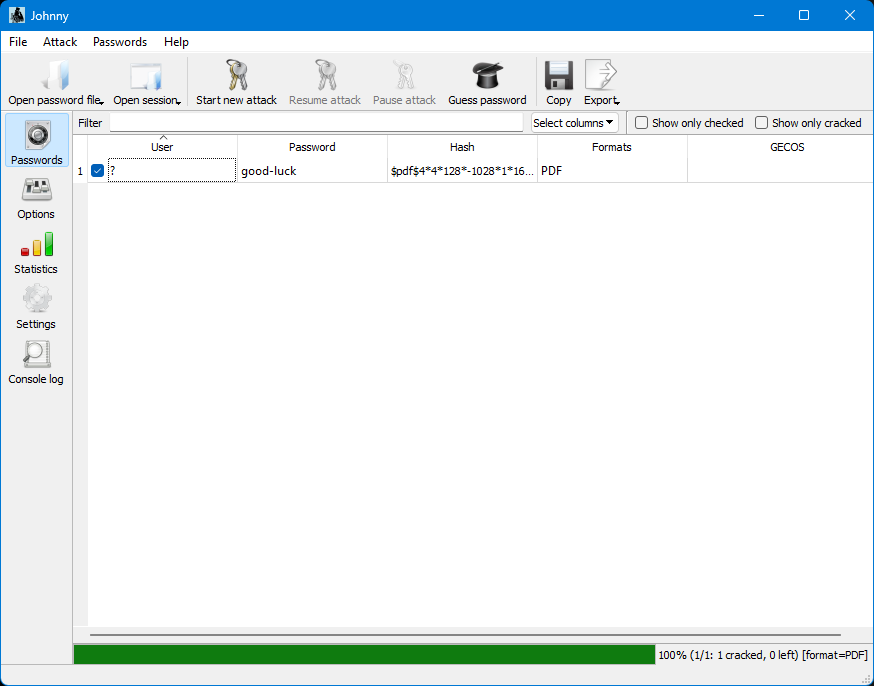
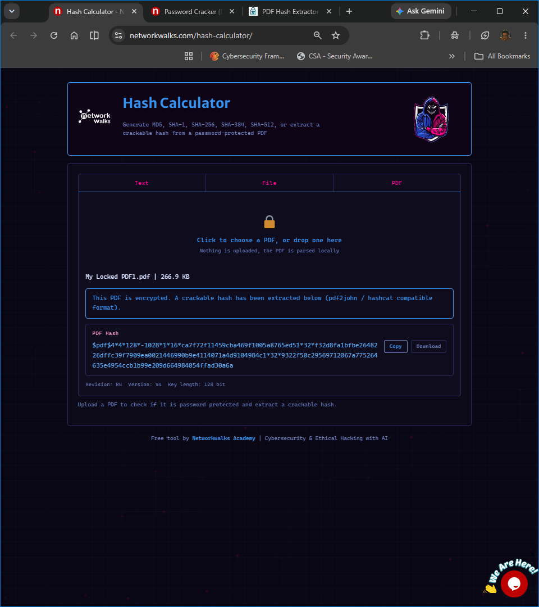
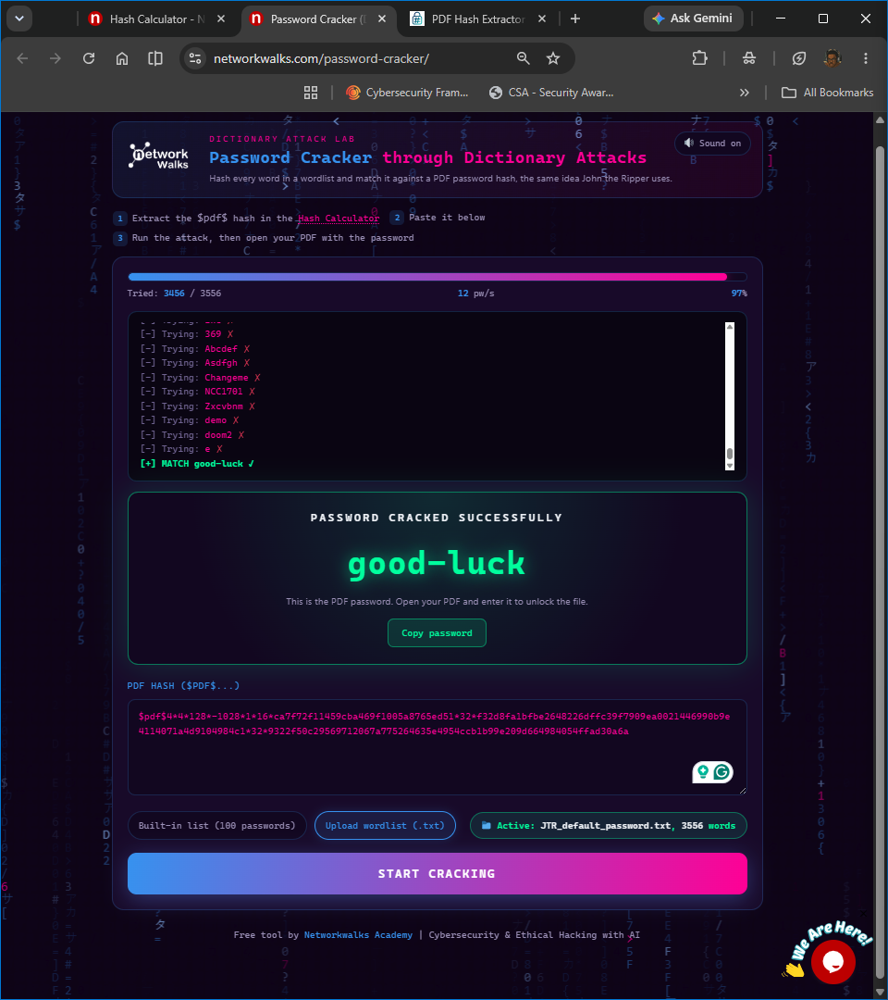

# Password Cracking with John the Ripper, Johnny & NETWORKWALKS Tools

**NETWORKWALKS Cybersecurity Internship — Week 3**  
**Batch B082**

Week 3 focused on password recovery from a protected PDF using two different workflows: a local **John the Ripper / Johnny** setup and the browser-based **NETWORKWALKS Hash Calculator and Password Cracker**.

Both essential modules were completed:

- **W3-PM1 — Password Cracking with JTR**
- **W3-PM2 — Password Cracking with NETWORKWALKS Tools**

The same supplied password-protected PDF was used to examine how hash extraction, password cracking and password verification fit together.

## Week 3 Progress

| Module | Focus | Status |
|---|---|---|
| W3-PM1 | Password Cracking with John the Ripper / Johnny | ✅ Completed |
| W3-PM2 | Password Cracking with NETWORKWALKS Tools | ✅ Completed |

## Password Recovery Workflow

Both exercises followed the same underlying process:

```text
Password-Protected PDF
        ↓
Extract Crackable $pdf$ Hash
        ↓
Password-Cracking Engine
        ↓
Candidate Password Testing
        ↓
Recovered Password
        ↓
Open PDF and Verify
```

The difference was primarily in how each workflow exposed and controlled the cracking process.

| Workflow | Environment | Interface | Approach |
|---|---|---|---|
| John the Ripper | Windows | Command line | Local password-cracking engine |
| Johnny | Windows | Graphical interface | GUI front end for John |
| NETWORKWALKS Password Cracker | Web browser | Browser interface | Dictionary attack against extracted PDF hash |

---

## W3-PM1 — Password Cracking with John the Ripper

**Platform:** Windows  
**Tools:** John the Ripper 1.9.0-jumbo-1, Johnny  
**Target:** `My Locked PDF1.pdf`  
**Technique:** Offline password recovery from an extracted PDF hash

W3-PM1 involved recovering the password of the supplied protected PDF using **John the Ripper** and its graphical front end, **Johnny**.

### John the Ripper Setup

John the Ripper was downloaded and extracted locally.

The executable used for the lab was located inside John's `run` directory:

```text
john-1.9.0-jumbo-1-win64/
└── run/
    └── JOHN.exe
```



Running `JOHN.exe` directly from Command Prompt confirmed that the installation was functional and exposed the available cracking modes and options.

### Johnny Configuration

Johnny was configured to use the same `JOHN.exe` installation as its cracking backend.



This clarified the relationship between the two tools:

```text
Johnny
   ↓
Graphical Interface
   ↓
John the Ripper
   ↓
Password-Cracking Engine
```

Johnny provides a graphical way to interact with John rather than operating as a separate password-cracking engine.

### PDF Hash Extraction

The protected PDF was first converted into a crackable hash representation.

Using the PDF Hash Extractor, `My Locked PDF1.pdf` produced a value beginning with:

```text
$pdf$...
```



The extracted value was saved locally as:

```text
My Locked PDF1.txt
```

The cracking process therefore operated against the extracted password-verification data rather than repeatedly attempting to open the document itself.

### Direct John CLI Attack

I also performed the attack directly through Command Prompt rather than relying only on Johnny.

The command used was:

```cmd
JOHN "C:\Users\Prince\Downloads\L\NWI\wk3\My Locked PDF1.txt"
```

John detected the input as a PDF hash:

```text
Loaded 1 password hash (PDF ...)
```

It then progressed through its configured default cracking sequence:

```text
Proceeding with single, rules:Single
...
Proceeding with wordlist:password.lst, rules:Wordlist
```

The attack completed successfully:

```text
1g ... DONE
Session completed
```



One useful observation from this run was that I did not manually supply a wordlist. John progressed through its configured cracking modes and then used its bundled `password.lst` wordlist automatically.

### Displaying the Recovered Password

The recovered result was displayed using:

```cmd
JOHN --show --format=PDF "C:\Users\Prince\Downloads\L\NWI\wk3\My Locked PDF1.txt"
```

John returned:

```text
?:good-luck

1 password hash cracked, 0 left
```



The recovered password was:

```text
good-luck
```

### Johnny Workflow

The same PDF hash was also loaded into Johnny.

Johnny displayed the recovered password through its graphical interface:



This provided a direct comparison between using John through the command line and interacting with the same cracking engine through a GUI.

---

## W3-PM2 — Password Cracking with NETWORKWALKS Tools

**Platform:** Web browser on Windows  
**Tools:** NETWORKWALKS Hash Calculator, NETWORKWALKS Password Cracker  
**Target:** `My Locked PDF1.pdf`  
**Technique:** Browser-based dictionary attack

W3-PM2 approached the same protected PDF through browser-based tools provided by NETWORKWALKS.

The workflow was:

```text
My Locked PDF1.pdf
        ↓
NETWORKWALKS Hash Calculator
        ↓
$pdf$ Hash
        ↓
NETWORKWALKS Password Cracker
        ↓
Dictionary Attack
        ↓
good-luck
```

### Hash Extraction

`My Locked PDF1.pdf` was loaded into the NETWORKWALKS Hash Calculator.

The tool detected the encrypted PDF and extracted a crackable `$pdf$` hash.



The extracted hash matched the PDF1 hash used during the JTR workflow, allowing both methods to operate against the same protected file.

### Dictionary Attack

The hash was then supplied to the NETWORKWALKS Password Cracker.

For this run, I uploaded:

```text
JTR_default_password.txt
```

The active wordlist contained **3,556 entries**.

The Password Cracker tested candidates from the dictionary until it found a match:

```text
good-luck
```



The browser-based result matched the password recovered through John the Ripper.

---

## Password Verification

The recovered password was used to open `My Locked PDF1.pdf` successfully.


The challenge flag has been redacted from the public evidence while retaining the visible completion confirmation.

---

## Comparing the Workflows

The two modules solved the same problem through different interfaces and execution environments.

| Area | John / Johnny | NETWORKWALKS Tools |
|---|---|---|
| Execution | Local | Browser-based |
| Hash input | Saved text file | Extracted and pasted through browser tools |
| Cracking engine | John the Ripper | NETWORKWALKS Password Cracker |
| Interface | CLI + GUI | Web interface |
| Wordlist behaviour | Default JTR cracking sequence | User-supplied dictionary |
| Recovered password | `good-luck` | `good-luck` |
| Verification | PDF opened successfully | PDF opened successfully |

The extracted hash was the common input between both workflows:

```text
                 My Locked PDF1.pdf
                         ↓
                     $pdf$ Hash
                      ↙     ↘
                     /       \
          John the Ripper   NETWORKWALKS
                ↓           Password Cracker
                ↓                ↓
             good-luck        good-luck
                    \          /
                     \        /
                     PDF Unlocked
```

## Key Observations

### Johnny is an interface for John

Configuring Johnny required pointing it directly to `JOHN.exe`.

The graphical application therefore provides an alternative interface to John rather than a separate cracking implementation.

### Hash extraction is a distinct stage

Both workflows required the password-protected PDF to first be represented as a crackable `$pdf$` hash.

```text
Protected File
     ↓
Hash Extraction
     ↓
Password Recovery
     ↓
Verification
```

Separating these stages made the overall password-recovery process clearer.

### John can progress through cracking modes automatically

The direct CLI run showed John moving from:

```text
single mode
```

to:

```text
wordlist:password.lst
```

without a manually supplied dictionary.

This also explained why Johnny could begin a new attack without requiring me to import a wordlist first.

### Dictionary attacks depend on candidate selection

The NETWORKWALKS Password Cracker used the supplied `JTR_default_password.txt` dictionary.

The password was recoverable because the correct candidate existed within the wordlist.

```text
Candidate absent from dictionary
            ↓
No match through that dictionary

Candidate present in dictionary
            ↓
Recovery becomes possible
```

## What I Learned

### The cracking tool operates against password-verification data

The password-protected PDF contains data that allows software to determine whether a supplied candidate password is correct.

Hash extraction converts that data into a representation that password-cracking tools can process efficiently.

### Different interfaces can expose the same underlying technique

John CLI, Johnny and the NETWORKWALKS Password Cracker present different interfaces, but each ultimately tests candidate passwords against password-verification data.

Their major differences are in execution environment, interface and configuration.

### Recovering a password is not the same as breaking encryption

The exercise demonstrated recovery of a weak password through candidate testing.

It did not demonstrate defeat of the underlying encryption algorithm.

```text
Recovering a Weak Password
           ≠
Breaking the Encryption Algorithm
```

### Password choice directly affects cracking resistance

Dictionary attacks are particularly effective when passwords are common, predictable or already present in password lists.

Longer and less predictable passwords reduce the effectiveness of simple dictionary-based attacks by making successful candidates less likely to appear in a limited wordlist.

## Evidence Handling

The repository contains selected evidence demonstrating:

- John the Ripper installation
- Johnny configuration
- PDF hash extraction
- direct JTR command-line cracking
- recovered password output
- Johnny password display
- NETWORKWALKS Hash Calculator usage
- NETWORKWALKS dictionary attack
- successful PDF verification

Challenge flags contained within the supplied lab files were redacted before publication.

## Repository Structure

```text
.
├── evidence/
│   ├── pm1-jtr/
│   │   ├── 01-john-executable.png
│   │   ├── 02-johnny-john-configuration.png
│   │   ├── 03-pdf1-hash-extracted.png
│   │   ├── 04-john-cli-crack-completed.png
│   │   ├── 05-john-cli-show-password.png
│   │   └── 06-johnny-pdf1-password-recovered.png
│   │
│   ├── pm2-networkwalks-tools/
│   │   ├── 01-networkwalks-hash-calculator-pdf1.png
│   │   └── 02-networkwalks-password-cracker-good-luck.png
│   │
│   └── shared/
│       └── 01-pdf1-unlocked-flag-redacted.png
│
└── README.md
```

## Resources & Instructor Guidance

The Week 3 exercises were completed using the project instructions and lab resources provided through the **NETWORKWALKS Cybersecurity Internship Programme**.

**Instructor:** **Waqas Karim (CCIE)**

Tools used included:

- John the Ripper
- Johnny
- NETWORKWALKS Hash Calculator
- NETWORKWALKS Password Cracker
- PDF Hash Extractor
- supplied password dictionaries

## Ethical Use & Scope

All password-recovery activity documented in this repository was performed against files supplied specifically for the **NETWORKWALKS Cybersecurity Internship Programme, Batch B082**.

The exercises were completed for authorised educational purposes only.

No password recovery or cracking activity was performed against third-party accounts, systems or files outside the lab scope.

## Week 3 Takeaway

Week 3 demonstrated how the same password-recovery problem can be approached through different tooling.

John the Ripper exposed the mechanics of local password cracking, Johnny provided a graphical interface to the same engine, and the NETWORKWALKS tools demonstrated browser-based hash extraction and dictionary testing.

The underlying workflow remained consistent:

```text
Extract
   ↓
Test
   ↓
Recover
   ↓
Verify
```

## Author

**Prince Manu Gyebi**  
Cybersecurity Intern — Batch B082  
NETWORKWALKS

LinkedIn: [Prince Manu Gyebi](https://www.linkedin.com/in/princemanugyebi)
